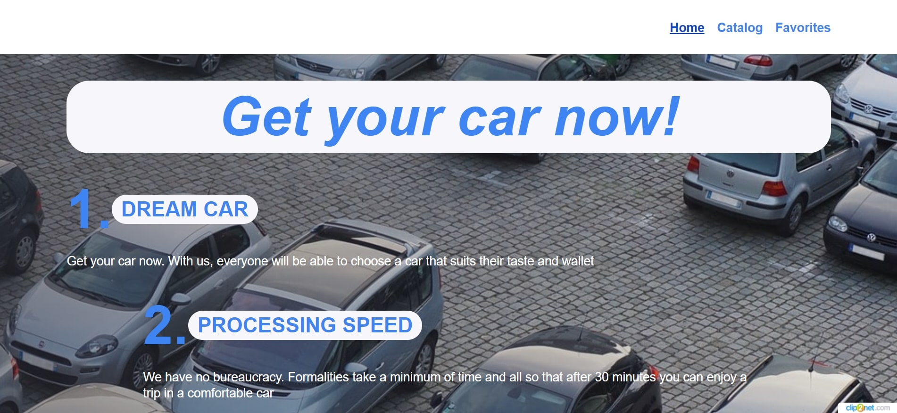
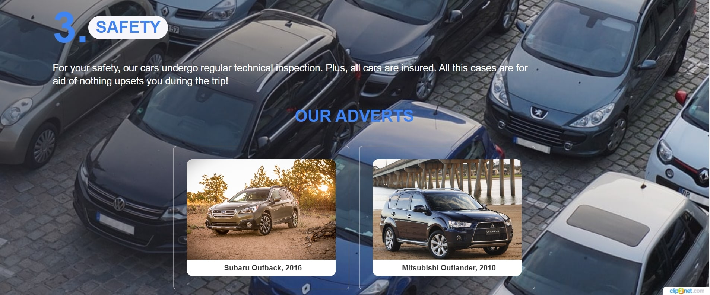
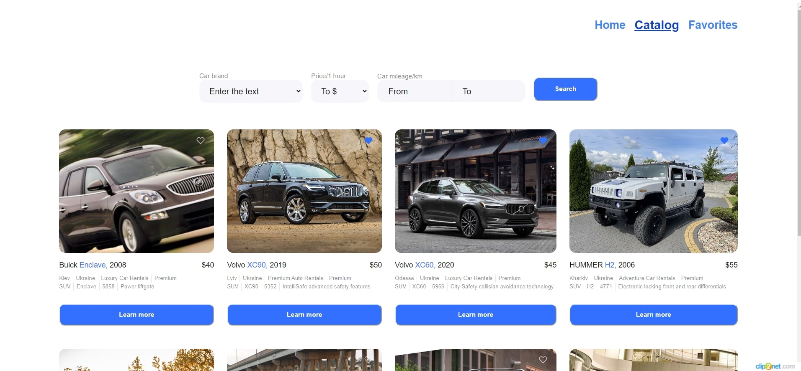
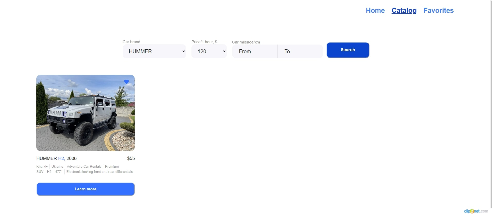
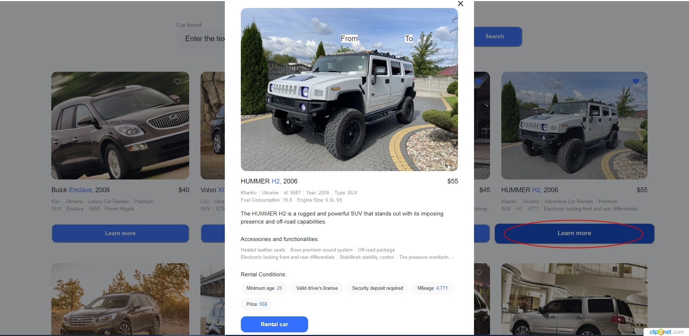
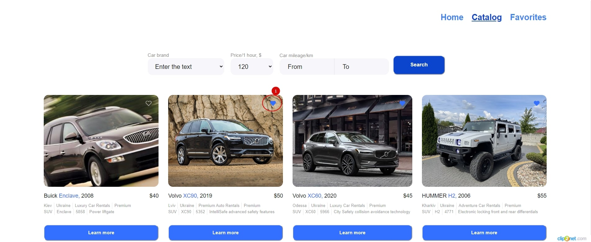
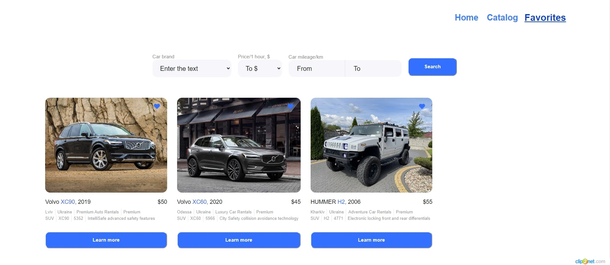

# Get your car now!

This site was created to quickly and safely search for cars provided in rent.

## Home page

During the first entering to the site, the user sees the main page of the site,
where is possible to get acquainted with the advantages of renting cars in our
company.

At the bottom of the main page, the user can familiarize himself with the list
of available for rental car brands.

## Catalog of cars

The car catalog page provides the user with an expanded option form to get
information about cars available for rent with a convenient batch loading
(pagination).

### Data filtering by cars

Data filtering options are available:

- **car brands**;
- **rental cost (for 1 hour)**;
- **total vehicle mileage in kilometers (from and to)**.

### Detailed information on the car and rental conditions

By pressing the button `Learn more` a modal window opens with a full information
about the car and its rental conditions

### Add to favorites

Click on the icon `heart` will add the car to the favorites catalog cars on the
page `Favorites`.

## Selected cars page

The entire list of selected cars is displayed. The same actions are available as
on page `Catalog`: filtering, viewing detailed information on the car,
pagination.

