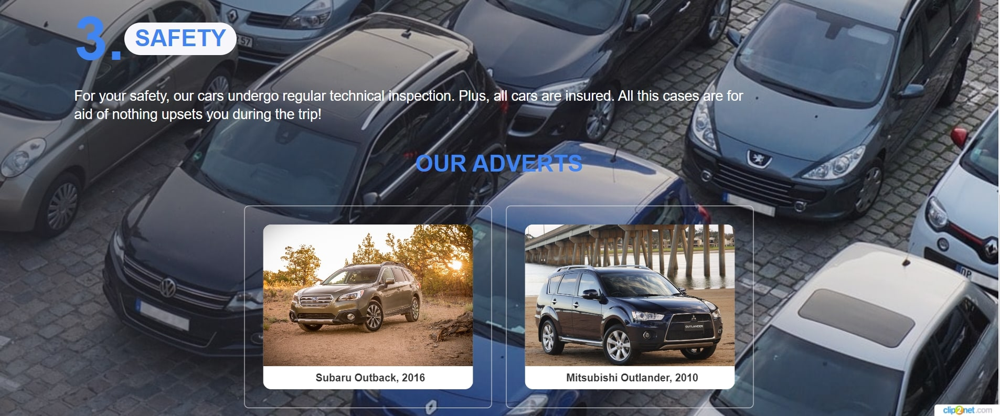
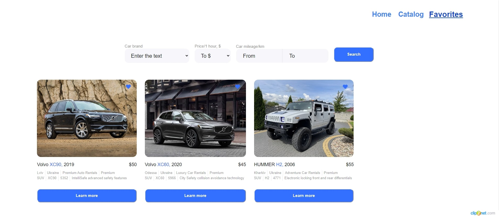

# Get your car now!

Цей сайт створено для швидкого та безпечного пошуку автомобілів, що надаються в
оренду.

## Головна сторінка

Під час першого входу на сайт користувач бачить головну сторінку сайту, де можна
ознайомитись із перевагами оренди автомобілів саме в нашій компанії.

Внизу головної сторінки користувач має ознайомитися з переліком доступних для
оренди марок автомобілів.

## Каталог автомобілів

Сторінка з каталогом автомобілів надає можливість користувачу в розгорнутому
вигляді отримати інформацію про доступні для оренди автомобілі із зручним
порційним завантаженням (пагінацією).

### Фільтрація даних по автомобілях

Доступні варіанти фільтрування даних:

- **маркою автомобіля**;
- **вартістю оренди (за 1 годину)**;
- **загальним пробігом автомобіля в кіломентах (від та до)**.

### Детальна інформація по автомобілю та умовах оренди

По натисненю на кнопку `Learn more` відкривається модальне вікно з повною
інформацією про автомобіль та умови його оренди

### Додавання у вибране

Натиснення на іконку `сердечка` додасть вибраний автомобіль в каталог обраних
автомобілів на сторінці `Favorites`.

## Сторінка обраних автомобілів

Відображається весь перелік обраних автомобілів. Доступні ті ж самі дії, що і на
сторінці `Catalog`: фільтрація, перегляд детальної інфорації по автомобілю,
пагінація.

